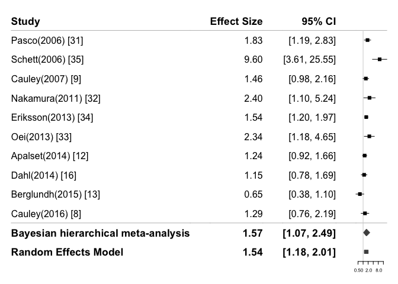

bayesmeta
================

The following code provides the generation of results (Including estimates, confidence interval, credible interval for mean estimates, heterogeneity measures, forest plot, subgroup analysis and funnel plot).

``` r
#install.packages("meta")
library(meta)
```

    ## Loading 'meta' package (version 5.5-0).
    ## Type 'help(meta)' for a brief overview.
    ## Readers of 'Meta-Analysis with R (Use R!)' should install
    ## older version of 'meta' package: https://tinyurl.com/dt4y5drs

``` r
setwd("~/Desktop/miscellaneous")
crp<-read.csv("CRP.csv")
crp[1:10]
```

    ##               study        ub        lb cytokine.Type    comparison year
    ## 1      Pasco (2006)  2.830500 1.1853000           CRP 1SD increment 2006
    ## 2     Schett (2006) 25.500000 3.6000000           CRP      T3 vs T1 2006
    ## 3     Cauley (2007)  2.155400 0.9850000           CRP    Q4 vs Q123 2007
    ## 4   Nakamura (2011)  5.240000 1.1000000           CRP      T3 vs T1 2010
    ## 5   Eriksson (2013)  1.970000 1.2000000           CRP      T3 vs T1 2013
    ## 6        Oei (2013)  4.580000 1.1600000           CRP      unit.log 2013
    ## 7    Apalset (2014)  1.659600 0.9202000           CRP      Q4 vs Q1 2014
    ## 8       Dahl (2014)  1.690000 0.7800000           CRP      T3 vs T2 2014
    ## 9  Berglundh (2015)  1.102139 0.3761358           CRP      Q4 vs Q1 2015
    ## 10    Cauley (2016)  2.192900 0.7630000           CRP      Q4 vs Q1 2016
    ##           SE    effect other.inf      region
    ## 1  0.2220555 1.8317000         0   Australia
    ## 2  0.4994246 9.6000000         0     Germany
    ## 3  0.1997678 1.4570490         1          US
    ## 4  0.3982172 2.4000000         0       Japan
    ## 5  0.1264571 1.5400000         1      Sweden
    ## 6  0.3503263 2.3400000         1 Netherlands
    ## 7  0.1504441 1.2358000         1      Norway
    ## 8  0.1972423 1.1500000         0      Norway
    ## 9  0.2742495 0.6450904         0      Sweden
    ## 10 0.2693169 1.2935000         1          US

``` r
meta.crp<-metagen(studlab = study, log(crp$effect),sm = "RR", crp$SE,data = crp)
meta.crp
```

    ## Number of studies combined: k = 10
    ## 
    ##                          RR           95%-CI    z  p-value
    ## Common effect model  1.4365 [1.2600; 1.6379] 5.41 < 0.0001
    ## Random effects model 1.5880 [1.1442; 2.2037] 2.77   0.0057
    ## 
    ## Quantifying heterogeneity:
    ##  tau^2 = 0.2083 [0.0724; 1.4890]; tau = 0.4564 [0.2690; 1.2202]
    ##  I^2 = 70.5% [43.6%; 84.6%]; H = 1.84 [1.33; 2.55]
    ## 
    ## Test of heterogeneity:
    ##      Q d.f. p-value
    ##  30.52    9  0.0004
    ## 
    ## Details on meta-analytical method:
    ## - Inverse variance method
    ## - Restricted maximum-likelihood estimator for tau^2
    ## - Q-Profile method for confidence interval of tau^2 and tau

``` r
radial(meta.crp)
```


``` r
#Substitute the object with fixed effect estimates by Bayesian estimates
meta.crp$TE.fixed = log(1.57)
meta.crp$lower.fixed = log(1.07)
meta.crp$upper.fixed = log(2.49)
meta.crp$studlab = c("Pasco (2006) (31)","Schett (2006) (35)","Cauley (2007) (9)", "Nakamura (2011) (32)", "Eriksson (2013) (34)", "Oei (2014) (33)", "Apalset (2014) (12)", "Dahl (2014) (16)", "Berglundh (2015) (13)", "Cauley (2016) (8)")
### Substitute fixed effect by Bayesian Estimates
forest(meta.crp,print.Q = TRUE,print.I2 = FALSE,print.pval.Q = TRUE,sortvar = crp$year,leftcols = c("studlab"),rightcols=c("effect", "ci"),,smlab = NULL,rightlabs=c("Effect Size","95% CI"),pval.random=TRUE,print.tau2 = FALSE,comb.fixed = TRUE,text.random = "Random Effects Model", text.fixed = "Pooled Estimate for Bayesian Method")
```


``` r
metainf(meta.crp)
```

    ## Influential analysis (Common effect model)
    ## 
    ##                                      RR           95%-CI  p-value   tau^2
    ## Omitting Pasco (2006) (31)       1.4021 [1.2219; 1.6089] < 0.0001  0.2682
    ## Omitting Schett (2006) (35)      1.3875 [1.2155; 1.5839] < 0.0001  0.0375
    ## Omitting Cauley (2007) (9)       1.4340 [1.2476; 1.6481] < 0.0001  0.2789
    ## Omitting Nakamura (2011) (32)    1.4153 [1.2390; 1.6167] < 0.0001  0.2253
    ## Omitting Eriksson (2013) (34)    1.3982 [1.1980; 1.6319] < 0.0001  0.2850
    ## Omitting Oei (2014) (33)         1.4102 [1.2339; 1.6119] < 0.0001  0.2279
    ## Omitting Apalset (2014) (12)     1.4909 [1.2878; 1.7260] < 0.0001  0.2688
    ## Omitting Dahl (2014) (16)        1.4787 [1.2863; 1.7000] < 0.0001  0.2570
    ## Omitting Berglundh (2015) (13)   1.5112 [1.3201; 1.7301] < 0.0001  0.0866
    ## Omitting Cauley (2016) (8)       1.4465 [1.2633; 1.6562] < 0.0001  0.2674
    ##                                                                          
    ## Pooled estimate                  1.4365 [1.2600; 1.6379] < 0.0001  0.2083
    ##                                      tau    I^2
    ## Omitting Pasco (2006) (31)        0.5179  72.6%
    ## Omitting Schett (2006) (35)       0.1937  49.3%
    ## Omitting Cauley (2007) (9)        0.5282  73.8%
    ## Omitting Nakamura (2011) (32)     0.4747  72.2%
    ## Omitting Eriksson (2013) (34)     0.5338  73.4%
    ## Omitting Oei (2014) (33)          0.4774  71.9%
    ## Omitting Apalset (2014) (12)      0.5185  72.7%
    ## Omitting Dahl (2014) (16)         0.5069  72.5%
    ## Omitting Berglundh (2015) (13)    0.2943  62.7%
    ## Omitting Cauley (2016) (8)        0.5171  73.6%
    ##                                                
    ## Pooled estimate                   0.4564  70.5%
    ## 
    ## Details on meta-analytical method:
    ## - Inverse variance method
    ## - Restricted maximum-likelihood estimator for tau^2

``` r
metacum(meta.crp)
```

    ## Cumulative meta-analysis (Common effect model)
    ## 
    ##                                          RR           95%-CI  p-value   tau^2
    ## Adding Pasco (2006) (31) (k=1)       1.8317 [1.1853; 2.8305]   0.0064        
    ## Adding Schett (2006) (35) (k=2)      2.4077 [1.6177; 3.5835] < 0.0001  1.2227
    ## Adding Cauley (2007) (9) (k=3)       1.8657 [1.4115; 2.4661] < 0.0001  0.8043
    ## Adding Nakamura (2011) (32) (k=4)    1.9197 [1.4762; 2.4965] < 0.0001  0.4557
    ## Adding Eriksson (2013) (34) (k=5)    1.7084 [1.4266; 2.0459] < 0.0001  0.2982
    ## Adding Oei (2014) (33) (k=6)         1.7434 [1.4644; 2.0755] < 0.0001  0.1853
    ## Adding Apalset (2014) (12) (k=7)     1.5947 [1.3724; 1.8529] < 0.0001  0.1673
    ## Adding Dahl (2014) (16) (k=8)        1.5278 [1.3284; 1.7573] < 0.0001  0.1430
    ## Adding Berglundh (2015) (13) (k=9)   1.4465 [1.2633; 1.6562] < 0.0001  0.2674
    ## Adding Cauley (2016) (8) (k=10)      1.4365 [1.2600; 1.6379] < 0.0001  0.2083
    ##                                                                              
    ## Pooled estimate                      1.4365 [1.2600; 1.6379] < 0.0001  0.2083
    ##                                          tau    I^2
    ## Adding Pasco (2006) (31) (k=1)                     
    ## Adding Schett (2006) (35) (k=2)       1.1057  89.1%
    ## Adding Cauley (2007) (9) (k=3)        0.8968  83.7%
    ## Adding Nakamura (2011) (32) (k=4)     0.6751  76.3%
    ## Adding Eriksson (2013) (34) (k=5)     0.5461  71.6%
    ## Adding Oei (2014) (33) (k=6)          0.4304  66.3%
    ## Adding Apalset (2014) (12) (k=7)      0.4090  67.9%
    ## Adding Dahl (2014) (16) (k=8)         0.3781  66.8%
    ## Adding Berglundh (2015) (13) (k=9)    0.5171  73.6%
    ## Adding Cauley (2016) (8) (k=10)       0.4564  70.5%
    ##                                                    
    ## Pooled estimate                       0.4564  70.5%
    ## 
    ## Details on meta-analytical method:
    ## - Inverse variance method
    ## - Restricted maximum-likelihood estimator for tau^2

``` r
meta.crp1<-update.meta(meta.crp,byvar=Gender)
forest(meta.crp1,print.Q = TRUE)
```


``` r
#Gender: 0: Women Only, 1: Both 2: Men Only
meta.crp1
```

    ## Number of studies combined: k = 10
    ## 
    ##                          RR           95%-CI    z  p-value
    ## Common effect model  1.4365 [1.2600; 1.6379] 5.41 < 0.0001
    ## Random effects model 1.5880 [1.1442; 2.2037] 2.77   0.0057
    ## 
    ## Quantifying heterogeneity:
    ##  tau^2 = 0.2083 [0.0724; 1.4890]; tau = 0.4564 [0.2690; 1.2202]
    ##  I^2 = 70.5% [43.6%; 84.6%]; H = 1.84 [1.33; 2.55]
    ## 
    ## Test of heterogeneity:
    ##      Q d.f. p-value
    ##  30.52    9  0.0004
    ## 
    ## Results for subgroups (common effect model):
    ##              k     RR           95%-CI     Q   I^2
    ## Gender = 0   4 1.2887 [1.0407; 1.5958] 11.39 73.7%
    ## Gender = 2   4 1.5860 [1.2388; 2.0306] 17.07 82.4%
    ## Gender = 1   2 1.4922 [1.1923; 1.8675]  0.34  0.0%
    ## 
    ## Test for subgroup differences (common effect model):
    ##                    Q d.f. p-value
    ## Between groups  1.72    2  0.4235
    ## Within groups  28.80    7  0.0002
    ## 
    ## Results for subgroups (random effects model):
    ##              k     RR           95%-CI  tau^2    tau
    ## Gender = 0   4 1.3282 [0.7936; 2.2231] 0.2080 0.4561
    ## Gender = 2   4 2.2753 [0.9722; 5.3250] 0.6492 0.8057
    ## Gender = 1   2 1.4922 [1.1923; 1.8675]      0      0
    ## 
    ## Test for subgroup differences (random effects model):
    ##                     Q d.f. p-value
    ## Between groups   1.14    2  0.5660
    ## 
    ## Details on meta-analytical method:
    ## - Inverse variance method
    ## - Restricted maximum-likelihood estimator for tau^2
    ## - Q-Profile method for confidence interval of tau^2 and tau

``` r
forest(meta.crp1)
```


``` r
meta.crp1$pval.random.w
```

    ## [1] 0.2800655360 0.0580996087 0.0004707955

``` r
meta.crp2<-update.meta(meta.crp,byvar=region_code)
forest(meta.crp2,print.Q = TRUE)
```


``` r
#region_code: 1: US 2：Europe; 3: Other
meta.crp14 <- update(meta.crp, byvar=ifelse(Population > 1000,"Population>1000", "Population<1000"),print.byvar=FALSE)
forest(meta.crp14,print.Q=TRUE)
```


``` r
meta.crp15<-update(meta.crp,byvar = ifelse(follow.up>10,"follow-up>10", "follow-up<10"))
forest(meta.crp15,print.Q=TRUE)
```


``` r
meta.crp$pval.random
```

    ## [1] 0.005678809

``` r
1-pchisq(meta.crp$Q,meta.crp$df.Q) #for heterogeneity test
```

    ## [1] 0.0003578644

``` r
meta.crp$Q
```

    ## [1] 30.51884

``` r
funnel(meta.crp,comb.random  = FALSE)
```


``` r
metabias(meta.crp,method.bias = "linreg")
```

    ## Linear regression test of funnel plot asymmetry
    ## 
    ## Test result: t = 1.33, df = 8, p-value = 0.2208
    ## 
    ## Sample estimates:
    ##    bias se.bias intercept se.intercept
    ##  1.9952  1.5024   -0.0297       0.3179
    ## 
    ## Details:
    ## - multiplicative residual heterogeneity variance (tau^2 = 3.1258)
    ## - predictor: standard error
    ## - weight:    inverse variance
    ## - reference: Egger et al. (1997), BMJ

``` r
metabias(meta.crp,method.bias = "rank")
```

    ## Rank correlation test of funnel plot asymmetry
    ## 
    ## Test result: z = 1.52, p-value = 0.1284
    ## 
    ## Sample estimates:
    ##       ks   se.ks
    ##  17.0000 11.1803
    ## 
    ## - reference: Begg & Mazumdar (1993), Biometrics

``` r
library(bayesmeta)
```

    ## Warning: package 'bayesmeta' was built under R version 4.0.5

    ## Loading required package: forestplot

    ## Loading required package: grid

    ## Loading required package: magrittr

    ## Warning: package 'magrittr' was built under R version 4.0.5

    ## Loading required package: checkmate

    ## Loading required package: metafor

    ## Loading required package: Matrix

    ## Loading required package: metadat

    ## Warning: package 'metadat' was built under R version 4.0.5

    ## 
    ## Loading the 'metafor' package (version 3.8-1). For an
    ## introduction to the package please type: help(metafor)

    ## Loading required package: mvtnorm

    ## Loading required package: numDeriv

    ## 
    ## Attaching package: 'bayesmeta'

    ## The following object is masked from 'package:stats':
    ## 
    ##     convolve

``` r
x = bayesmeta(y = log(crp$effect),sigma = crp$SE,labels = meta.crp$studlab)
fp = forestplot.bayesmeta(x,expo = TRUE,shrinkage = FALSE,xlog=TRUE,heterogeneity = FALSE)
```


Calculation of *P*(*μ* &gt; 0|*y*, *σ*) is equivalent to *P*(*R**R* &gt; 1|*y*, *σ*). Calculation of *P*(*μ* &gt; *l**o**g*(1.1)|*y*, *σ*) is equivalent to *P*(*R**R* &gt; 1.1|*y*, *σ*). Calculation of *P*(*μ* &gt; *l**o**g*(1.2)|*y*, *σ*) is equivalent to *P*(*R**R* &gt; 1.2|*y*, *σ*).

``` r
1-x$pposterior(mu=0)
```

    ## [1] 0.9868768

``` r
1-x$pposterior(mu = log(1.1))
```

    ## [1] 0.9701964

``` r
1-x$pposterior(mu = log(1.2))
```

    ## [1] 0.9349354

Note that the `echo = FALSE` parameter was added to the code chunk to prevent printing of the R code that generated the plot.

``` r
data = fp$data
rowname = rownames(data)
rowname[11] = "Bayesian hierarchical meta-analysis"
rowname[12] = "Random Effects Model (Classical meta-analysis)"
rownames(data) = rowname
data
```

    ##                                                 estimate     lower     upper
    ## Pasco (2006) (31)                              1.8317000 1.1853330  2.830534
    ## Schett (2006) (35)                             9.6000000 3.6071168 25.549492
    ## Cauley (2007) (9)                              1.4570490 0.9849892  2.155345
    ## Nakamura (2011) (32)                           2.4000000 1.0996340  5.238106
    ## Eriksson (2013) (34)                           1.5400000 1.2019329  1.973155
    ## Oei (2014) (33)                                2.3400000 1.1776537  4.649584
    ## Apalset (2014) (12)                            1.2358000 0.9202163  1.659612
    ## Dahl (2014) (16)                               1.1500000 0.7812767  1.692742
    ## Berglundh (2015) (13)                          0.6450904 0.3768591  1.104237
    ## Cauley (2016) (8)                              1.2935000 0.7629982  2.192852
    ## Bayesian hierarchical meta-analysis            1.5735399 1.0654203  2.489282
    ## Random Effects Model (Classical meta-analysis) 1.5591962 0.4422033  6.050633

``` r
data[12,] = c(1.54,1.18,2.01)
fp$data = data
label = fp$labeltext
label[1,1] = "Study"
label[1,2] = "Effect Size"
label[1,3] = "95% CI"
label[2,1] = "Pasco(2006) [31]"
label[3,1] = "Schett(2006) [35]"
label[4,1] = "Cauley(2007) [9]"
label[5,1] = "Nakamura(2011) [32]"
label[6,1] = "Eriksson(2013) [34]"
label[7,1] = "Oei(2013) [33]"
label[8,1] = "Apalset(2014) [12]"
label[9,1] = "Dahl(2014) [16]"
label[10,1] = "Berglundh(2015) [13]"
label[11,1] = "Cauley(2016) [8]"
label[12,1] = "Bayesian hierarchical meta-analysis"
label[13,1] = "Random Effects Model"
label[13,2] = "1.54"
label[13,3] = "[1.18, 2.01]"
fp$labeltext = label
sum = x$summary
sum[2,3] = log(1.54)
sum[5,3] = log(1.18)
sum[6,3] = log(2.01)
x$summary = sum
forestplot.bayesmeta(x,labeltext = fp$labeltext,shrinkage = FALSE,heterogeneity = FALSE,expo = TRUE,xlog=TRUE)
```



``` r
library(bayesmeta)
setwd("~/Desktop/miscellaneous")
crp<-read.csv("CRP.csv")
crp[1:10]
```

    ##               study        ub        lb cytokine.Type    comparison year
    ## 1      Pasco (2006)  2.830500 1.1853000           CRP 1SD increment 2006
    ## 2     Schett (2006) 25.500000 3.6000000           CRP      T3 vs T1 2006
    ## 3     Cauley (2007)  2.155400 0.9850000           CRP    Q4 vs Q123 2007
    ## 4   Nakamura (2011)  5.240000 1.1000000           CRP      T3 vs T1 2010
    ## 5   Eriksson (2013)  1.970000 1.2000000           CRP      T3 vs T1 2013
    ## 6        Oei (2013)  4.580000 1.1600000           CRP      unit.log 2013
    ## 7    Apalset (2014)  1.659600 0.9202000           CRP      Q4 vs Q1 2014
    ## 8       Dahl (2014)  1.690000 0.7800000           CRP      T3 vs T2 2014
    ## 9  Berglundh (2015)  1.102139 0.3761358           CRP      Q4 vs Q1 2015
    ## 10    Cauley (2016)  2.192900 0.7630000           CRP      Q4 vs Q1 2016
    ##           SE    effect other.inf      region
    ## 1  0.2220555 1.8317000         0   Australia
    ## 2  0.4994246 9.6000000         0     Germany
    ## 3  0.1997678 1.4570490         1          US
    ## 4  0.3982172 2.4000000         0       Japan
    ## 5  0.1264571 1.5400000         1      Sweden
    ## 6  0.3503263 2.3400000         1 Netherlands
    ## 7  0.1504441 1.2358000         1      Norway
    ## 8  0.1972423 1.1500000         0      Norway
    ## 9  0.2742495 0.6450904         0      Sweden
    ## 10 0.2693169 1.2935000         1          US

``` r
crp= crp[-2,]
meta.crp_ex<-metagen(studlab = study, log(crp$effect),sm = "RR", crp$SE,data = crp)
#Bayesian without schett
x = bayesmeta(y = log(crp$effect),sigma = crp$SE,labels = meta.crp_ex$studlab)
forestplot.bayesmeta(x,expo = TRUE,shrinkage = FALSE,xlog=TRUE,heterogeneity = FALSE)
```


``` r
c(1.39,1.08,1.81)
```

    ## [1] 1.39 1.08 1.81

``` r
#Then create forest plot again
meta.crp_ex$TE.fixed = log(1.39)
meta.crp_ex$lower.fixed = log(1.08)
meta.crp_ex$upper.fixed = log(1.81)
meta.crp_ex$studlab = c("Pasco (2006) (31)","Cauley (2007) (9)", "Nakamura (2011) (32)", "Eriksson (2013) (34)", "Oei (2014) (33)", "Apalset (2014) (12)", "Dahl (2014) (16)", "Berglundh (2015) (13)", "Cauley (2016) (8)")
forest.meta(meta.crp_ex,print.Q = TRUE,print.I2 = FALSE,print.pval.Q = TRUE,sortvar = crp$year,leftcols = c("studlab"),rightcols=c("effect", "ci"),,smlab = NULL,rightlabs=c("Effect Size","95% CI"),pval.random=TRUE,print.tau2 = FALSE,comb.fixed = TRUE,text.random = "Random Effects Model", text.fixed = "Pooled Estimate for Bayesian Method")
```


